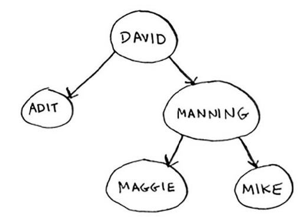
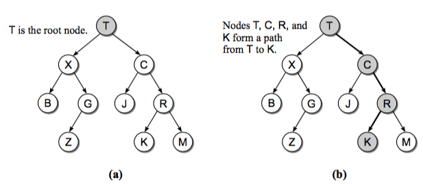
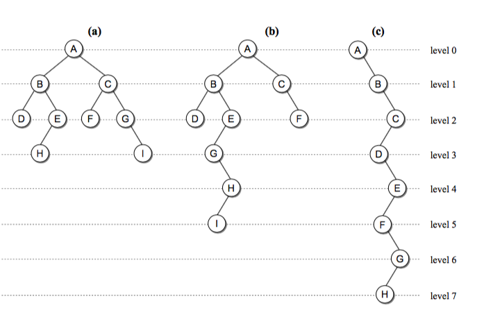
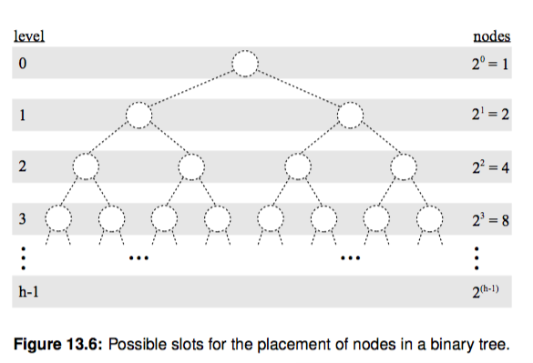
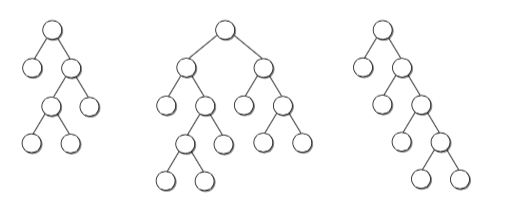
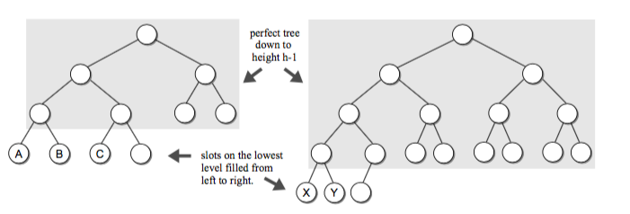

# 树和二叉树
前面我们讲了两种使用分治和递归解决排序问题的归并排序和快速排序，堆排序先就此打住，因为涉及到树的概念，所以我们先来讲讲树。
讲完了树之后后面我们开始介绍一种有用的数据结构堆(heap)， 以及借助堆来实现的堆排序，相比前两种排序算法要稍难理解和实现一些。

# 树
这里先简单讲讲树的概念。树结构是一种包括节点(nodes)和边(edges)的拥有层级关系的一种结构， 它的形式和家谱树非常类似:



如果你了解 linux 文件结构（tree 命令），它的结构也是一棵树。我们快速看下树涉及到的一些概念：



- 根节点(root): 树的最上层的节点，任何非空的树都有一个节点
- 路径(path): 从起始节点到终止节点经历过的边
- 父亲(parent)：除了根节点，每个节点的上一层边连接的节点就是它的父亲(节点)
- 孩子(children): 每个节点由边指向的下一层节点
- 兄弟(siblings): 同一个父亲并且处在同一层的节点
- 子树(subtree): 每个节点包含它所有的后代组成的子树
- 叶子节点(leaf node): 没有孩子的节点成为叶子节点


# 二叉树

了解完树的结构以后，我们来看树结构里一种简单但是却比较常用的树-二叉树。
二叉树是一种简单的树，它的每个节点最多只能包含两个孩子，以下都是一些合法的二叉树:




通过上边这幅图再来看几个二叉树相关的概念:

- 节点深度(depth): 节点对应的 level 数字
- 树的高度(height): 二叉树的高度就是 level 数 + 1，因为 level 从 0开始计算的
- 树的宽度(width): 二叉树的宽度指的是包含最多节点的层级的节点数
- 树的 size：二叉树的节点总个数。

一棵 size 为 n 的二叉树高度最多可以是 n，最小的高度是 $ \lfloor lgn \rfloor + 1 $，这里 log 以 2 为底简写为
lgn，和算法导论保持一致。这个结果你只需要用高中的累加公式就可以得到。

# 一些特殊的二叉树
在了解了二叉树的术语和概念之后，我们来看看一些特殊的二叉树，后续章节我们会用到：

### 满二叉树(full binary tree)
如果每个内部节点（非叶节点）都包含两个孩子，就成为满二叉树。下边是一些例子，它可以有多种形状：



### 完美二叉树(perfect binary tree)
当所有的叶子节点都在同一层就是完美二叉树，毫无间隙填充了 h 层。


### 完全二叉树(complete binary tree)
当一个高度为 h 的完美二叉树减少到 h-1，并且最底层的槽被毫无间隙地从左到右填充，我们就叫它完全二叉树。
下图就是完全二叉树的例子：



# 二叉树的表示
说了那么多，那么怎么表示一棵二叉树呢？其实你发现会和链表有一些相似之处，一个节点，然后节点需要保存孩子的指针，我以构造下边这个二叉树为例子：
我们先定义一个类表示节点：


```py
class BinTreeNode(object):
    def __init__(self, data, left=None, right=None):
        self.data, self.left, self.right = data, left, right
```

当然和链表类似，root 节点是我们的入口，于是乎定义一个 二叉树：

```py
class BinTree(object):
    def __init__(self, root=None):
        self.root = root
```

怎么构造上图中的二叉树呢，似乎其他课本没找到啥例子，我自己定义了一种方法，首先我们输入节点信息，仔细看下边代码，叶子节点的 left 和 right 都是 None，并且只有一个根节点 A:

```py
node_list = [
    {'data': 'A', 'left': 'B', 'right': 'C', 'is_root': True},
    {'data': 'B', 'left': 'D', 'right': 'E', 'is_root': False},
    {'data': 'D', 'left': None, 'right': None, 'is_root': False},
    {'data': 'E', 'left': 'H', 'right': None, 'is_root': False},
    {'data': 'H', 'left': None, 'right': None, 'is_root': False},
    {'data': 'C', 'left': 'F', 'right': 'G', 'is_root': False},
    {'data': 'F', 'left': None, 'right': None, 'is_root': False},
    {'data': 'G', 'left': 'I', 'right': 'J', 'is_root': False},
    {'data': 'I', 'left': None, 'right': None, 'is_root': False},
    {'data': 'J', 'left': None, 'right': None, 'is_root': False},
]
```

然后我们给 BinTreeNode 定义一个 build_from 方法：

```py
class BinTree(object):
    def __init__(self, root=None):
        self.root = root

    @classmethod
    def build_from(cls, node_list):
        """通过节点信息构造二叉树
        第一次遍历我们构造 node 节点
        第二次遍历我们给 root 和 孩子赋值
        最后我们用 root 初始化这个类并返回一个对象

        :param node_list: {'data': 'A', 'left': None, 'right': None, 'is_root': False}
        """
        node_dict = {}
        for node_data in node_list:
            data = node_data['data']
            node_dict[data] = BinTreeNode(data)
        for node_data in node_list:
            data = node_data['data']
            node = node_dict[data]
            if node_data['is_root']:
                root = node
            node.left = node_dict.get(node_data['left'])
            node.right = node_dict.get(node_data['right'])
        return cls(root)
btree = BinTree.build_from(node_list)
```

大功告成，这样我们就构造了一棵二叉树对象。下边我们看看它的一些常用操作。

# 二叉树的遍历
不知道你有没有发现，二叉树其实是一种递归结构，因为单独拿出来一个 subtree 子树出来，其实它还是一棵树。那遍历它就很方便啦，我们可以直接用递归的方式来遍历它。但是当处理顺序不同的时候，树又分为三种遍历方式:

- 先(根)序遍历: 先处理根，之后是左子树，然后是右子树
- 中(根)序遍历: 先处理左子树，之后是根，最后是右子树
- 后(根)序遍历: 先处理左子树，之后是右子树，最后是根

我们来看下实现，其实算是比较直白的递归函数:

```py
class BinTreeNode(object):
    def __init__(self, data, left=None, right=None):
        self.data, self.left, self.right = data, left, right


class BinTree(object):
    def __init__(self, root=None):
        self.root = root

    @classmethod
    def build_from(cls, node_list):
        """通过节点信息构造二叉树
        第一次遍历我们构造 node 节点
        第二次遍历我们给 root 和 孩子赋值

        :param node_list: {'data': 'A', 'left': None, 'right': None, 'is_root': False}
        """
        node_dict = {}
        for node_data in node_list:
            data = node_data['data']
            node_dict[data] = BinTreeNode(data)
        for node_data in node_list:
            data = node_data['data']
            node = node_dict[data]
            if node_data['is_root']:
                root = node
            node.left = node_dict.get(node_data['left'])
            node.right = node_dict.get(node_data['right'])
        return cls(root)

    def preorder_trav(self, subtree):
        """ 先(根)序遍历

        :param subtree:
        """
        if subtree is not None:
            print(subtree.data)    # 递归函数里先处理根
            self.preorder_trav(subtree.left)   # 递归处理左子树
            self.preorder_trav(subtree.right)    # 递归处理右子树


node_list = [
    {'data': 'A', 'left': 'B', 'right': 'C', 'is_root': True},
    {'data': 'B', 'left': 'D', 'right': 'E', 'is_root': False},
    {'data': 'D', 'left': None, 'right': None, 'is_root': False},
    {'data': 'E', 'left': 'H', 'right': None, 'is_root': False},
    {'data': 'H', 'left': None, 'right': None, 'is_root': False},
    {'data': 'C', 'left': 'F', 'right': 'G', 'is_root': False},
    {'data': 'F', 'left': None, 'right': None, 'is_root': False},
    {'data': 'G', 'left': 'I', 'right': 'J', 'is_root': False},
    {'data': 'I', 'left': None, 'right': None, 'is_root': False},
    {'data': 'J', 'left': None, 'right': None, 'is_root': False},
]
btree = BinTree.build_from(node_list)
btree.preorder_trav(btree.root)    # 输出 A, B, D, E, H, C, F, G, I, J
```
怎么样是不是挺简单的，比较直白的递归函数。如果你不明白，视频里我们会画个图来说明。

# 反转二叉树
之所以单拎出来说这个是因为 mac 下著名的 brew 工具作者据说是因为面试 google 白板编程没写出来反转二叉树跪了。然后人家就去了苹果 😂。其实吧和遍历操作相比也没啥太大区别，递归交换就是了：

```py
    def reverse(self, subtree):
        if subtree is not None:
            subtree.left, subtree.right = subtree.right, subtree.left
            self.reverse(subtree.left)
            self.reverse(subtree.right)
```


# 练习题
- 请你完成二叉树的中序遍历和后序遍历以及单元测试
- 树的遍历我们用了 print，请你尝试换成一个 callback，这样就能自定义处理树节点的方式了。
- 请问树的遍历操作时间复杂度是多少？假设它的 size 是 n
- 你能用非递归的方式来实现树的遍历吗？我们知道计算机内部使用了 stack，如果我们自己模拟如何实现？请你尝试完成


# 延伸阅读
- 《Data Structures and Algorithms in Python》 13 章 Binary Trees
-  [https://www.geeksforgeeks.org/iterative-preorder-traversal/](https://www.geeksforgeeks.org/iterative-preorder-traversal/)
